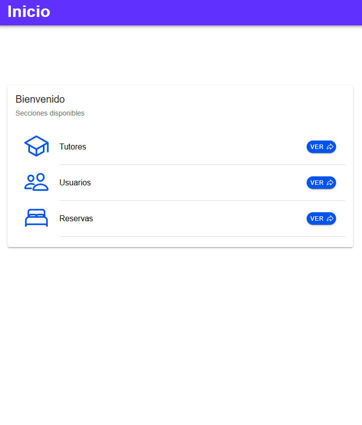

# WorldsAcross Frontend Test

### Pantalla inicio app

## Descripción

Esta es una prueba técnica para evaluar tus habilidades en Angular e Ionic. El objetivo es crear una aplicación frontend que consuma una API proporcionada.

## Cómo levantar la aplicación

Asegúrese de tener instaladas las CLIs de Ionic y Angular. Posteriormente:

1. Clone el repositorio
2. Instale las dependencias con `npm install`
3. Ejecute el comando `npm start`
